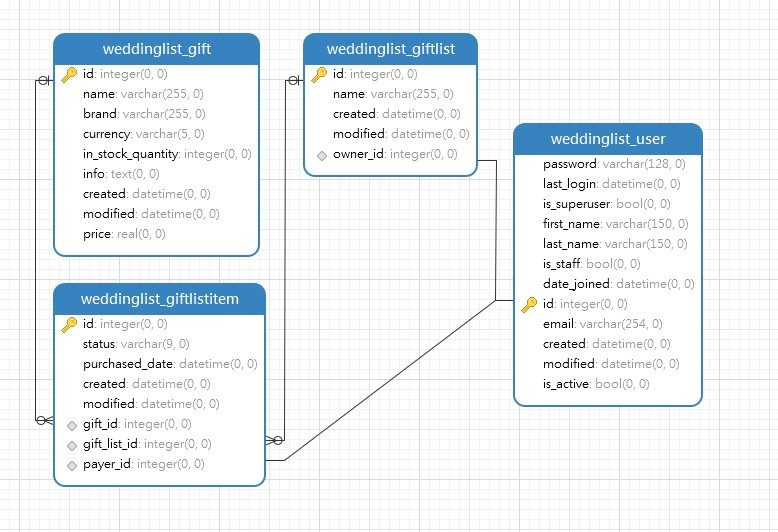

# Weddinglist API Django Backend application

## Django project setup steps

### Django project name

```
weddinglist
```

### Datatbase tables create from the models

I created three + one models Gift, GiftList, GiftlistItem and User with email authentication.



### I used SQLite DB

```
python manage.py migrate
python manage.py makemigrations pokecodexapi
```

### Created Admin User

### To login in please

```
user / pass
weddinglist@example.com / weddinglistadmin
```

## Django Rest Framework

- I used model serializer to create the api.
- I set up django rest framework pagination.
- Django filter to implement a filtering.

## Configuring CROSS-ORIGIN RESOURCE SHARING (CORS)

- django-cors-headers plugin solve the problem

# To Run the project

### Please navigate to the weddinglist directory.

### Create new python environment and activate it

On macOS and Linux:

```
python3 -m venv env
source env/bin/activate
```

On Windows:

```
py -m venv env
.\env\Scripts\activate
```

### Install requirements

```
pip install -r requirements.txt
python -m pip install --upgrade pip
```

### Run the server

```
python manage.py runserver
```

### Run tests

```
pytest
```

### Usefull links:

- Admin site: http://127.0.0.1:8000/admin/
  
- REST Framework: http://127.0.0.1:8000
  
- Swagger API: http://127.0.0.1:8000/swagger-ui/
  
- Gift list Report page: http://127.0.0.1:8000/report/1
  
